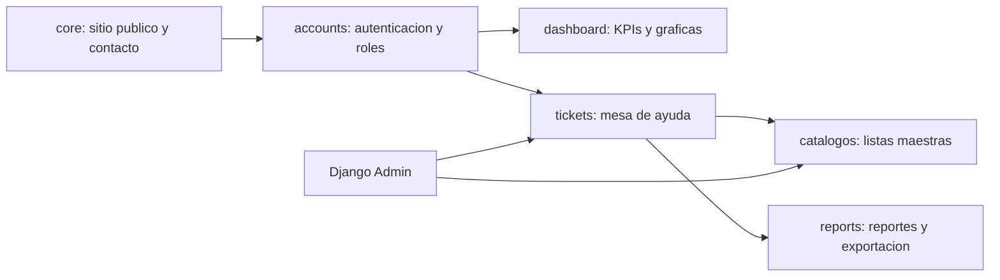
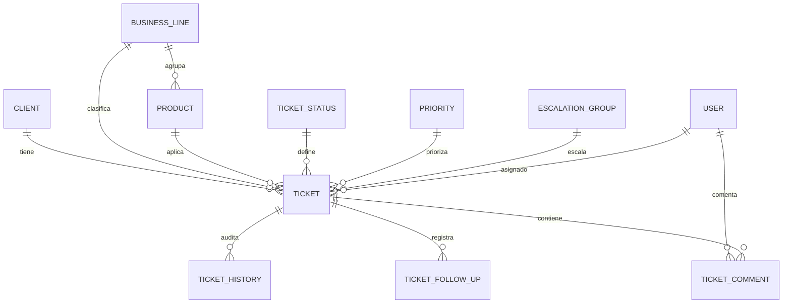

# Documentacion tecnica

## Arquitectura

El proyecto sigue una arquitectura modular basada en apps Django:

## Modelo entidad-relacion

## Flujo funcional

1. El usuario inicia sesion.
2. Crea o consulta un ticket.
3. Clasifica cliente, producto, linea, estado y prioridad.
4. Asigna responsable y, si aplica, grupo de escalamiento.
5. Registra comentarios y seguimientos.
6. Cierra el ticket con fecha de resolucion.
7. Consulta KPIs y exporta reportes.

## Roles

- Administrador: acceso completo y Django Admin.
- Auditor: consulta y revision.
- Analista de soporte: gestion operativa de tickets.
- Consultor: gestion y seguimiento.
- Cliente: solo lectura.

## Catalogos

Las listas maestras heredan un comportamiento comun:

- Nombre unico.
- Descripcion.
- Activo/inactivo.
- Fechas de creacion y actualizacion.

El bloqueo logico evita eliminar registros usados por tickets historicos.

## Reportes

Los reportes se generan desde el ORM y se exportan en:

- CSV: modulo estandar `csv`.
- Excel: `openpyxl`.
- PDF: `reportlab`.

## Preparacion para PostgreSQL

El archivo `settings.py` cambia a PostgreSQL cuando existe `DATABASE_URL` y usa las variables `POSTGRES_*`.
